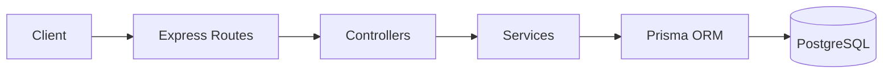
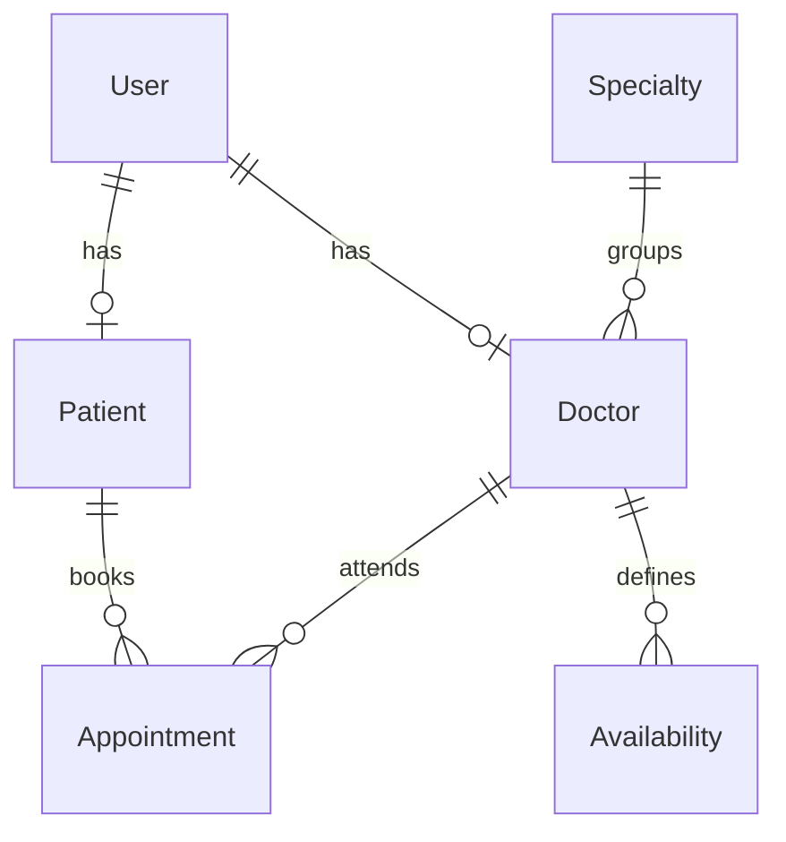

# Medical Appointments API


API REST para un sistema de gestión de turnos médicos. Implementa autenticación con JWT, autorización basada en roles, gestión de médicos, especialidades, disponibilidades semanales y reservas de turnos.

El proyecto está construido con TypeScript estricto, Express, Prisma ORM y PostgreSQL, con validación de inputs mediante Zod y una separación clara entre rutas, controladores, servicios y acceso a datos.

## Características principales

- Registro de pacientes y login con JWT.
- Autenticación por `Authorization: Bearer <accessToken>`.
- RBAC con roles `PATIENT`, `DOCTOR` y `ADMIN`.
- Gestión de especialidades médicas.
- Gestión administrativa de médicos.
- Gestión de disponibilidades semanales por médico.
- Consulta de slots disponibles por médico y fecha.
- Reserva, listado, detalle y cancelación de turnos por pacientes.
- Listado, detalle y actualización de estados de turnos por médicos.
- Health check público.
- Validación de entorno, parámetros, query strings y body con Zod.
- Manejo centralizado de errores con `requestId`.

## Roles

| Rol | Permisos implementados |
| --- | --- |
| `PATIENT` | Puede consultar médicos y especialidades, consultar slots disponibles, crear turnos, listar sus turnos, ver el detalle de sus turnos y cancelar turnos propios. |
| `DOCTOR` | Puede consultar sus turnos, ver el detalle de sus turnos y actualizar estados permitidos de sus turnos. |
| `ADMIN` | Puede crear, actualizar y desactivar especialidades; crear, actualizar y desactivar médicos; crear, actualizar y eliminar disponibilidades; consultar slots de médicos. |

## Stack tecnológico

| Tecnología | Uso |
| --- | --- |
| Node.js | Runtime de la API. |
| TypeScript | Tipado estático estricto. |
| Express | Servidor HTTP y routing. |
| PostgreSQL | Base de datos relacional. |
| Prisma ORM | Modelado de datos y acceso a PostgreSQL. |
| `@prisma/adapter-pg` | Adaptador PostgreSQL para Prisma. |
| Zod | Validación de variables de entorno, body, params y query. |
| JSON Web Token | Autenticación con access tokens firmados con HS256. |
| bcrypt | Hashing de passwords. |
| Helmet | Headers HTTP de seguridad. |
| CORS | Control de origen permitido para el cliente web. |
| Morgan | Logging HTTP en desarrollo y producción no-test. |
| Vitest | Tests automatizados. |
| Docker Compose | PostgreSQL local para desarrollo. |

## Arquitectura

La aplicación mantiene una arquitectura por capas. Las rutas definen el contrato HTTP, los controladores manejan request/response, los servicios concentran reglas de negocio y Prisma encapsula el acceso a PostgreSQL.



Responsabilidades principales:

| Capa | Responsabilidad |
| --- | --- |
| `src/routes` | Define endpoints y middlewares de autenticación/autorización. |
| `src/controllers` | Traduce HTTP a llamadas de servicio y arma respuestas. |
| `src/services` | Implementa reglas de negocio y operaciones con Prisma. |
| `src/schemas` | Define validaciones Zod para inputs externos. |
| `src/middlewares` | Autenticación, autorización, request id, not found y errores. |
| `src/config` | Configuración de entorno y cliente Prisma. |

## Autenticación y seguridad

- La API usa JWT Bearer tokens en el header `Authorization`.
- El login emite un access token firmado con `HS256`.
- El token incluye `sub` y `role`, y se valida con issuer y audience configurados en código.
- El usuario debe existir, estar activo y conservar el mismo rol que indica el token.
- Los passwords se almacenan con hash bcrypt.
- El registro público crea usuarios con rol `PATIENT`; el cliente no puede definir el rol.
- La autorización se aplica con RBAC mediante middleware `authorize`.
- Los inputs externos se validan con Zod.
- Helmet está habilitado para headers HTTP de seguridad.
- CORS permite requests sin `Origin` o desde `FRONTEND_URL`.
- Express JSON usa limite configurable mediante `JSON_BODY_LIMIT`.
- Cada request recibe un `X-Request-Id`.
- Los errores operacionales se devuelven con envelope consistente y `requestId`.

Actualmente no hay endpoint de refresh token ni logout server-side. La autenticación implementada es Bearer token, no cookies.

## Modelo de datos

Entidades principales definidas en Prisma:

| Entidad | Descripción |
| --- | --- |
| `User` | Cuenta base con email único, password hash, nombre, apellido, rol y estado activo. |
| `Patient` | Perfil de paciente asociado 1:1 a un `User`. |
| `Doctor` | Perfil médico asociado 1:1 a un `User`, con especialidad y matrícula profesional única. |
| `Specialty` | Especialidad médica con nombre único y estado activo. |
| `Availability` | Bloque semanal recurrente de atención de un médico. |
| `Appointment` | Turno concreto entre paciente y médico para una fecha/hora. |

Enums definidos:

| Enum | Valores |
| --- | --- |
| `UserRole` | `PATIENT`, `DOCTOR`, `ADMIN` |
| `WeekDay` | `MONDAY`, `TUESDAY`, `WEDNESDAY`, `THURSDAY`, `FRIDAY`, `SATURDAY`, `SUNDAY` |
| `AppointmentStatus` | `PENDING`, `CONFIRMED`, `CANCELLED`, `COMPLETED`, `NO_SHOW` |

Relaciones principales:



Notas de consistencia:

- `User.email` es único.
- `Doctor.professionalLicense` es única.
- `Availability` evita duplicados por médico, día y rango horario.
- Las migraciones incluyen restricciones SQL adicionales documentadas en `docs/database-constraints.md`.

## API

La base URL local por defecto es `http://localhost:4000`.

### Sistema

| Método | Endpoint | Rol | Descripción |
| --- | --- | --- | --- |
| `GET` | `/health` | Público | Health check de la API. |

### Auth

| Método | Endpoint | Rol | Descripción |
| --- | --- | --- | --- |
| `POST` | `/auth/register` | Público | Registra un usuario `PATIENT` y crea su perfil de paciente. |
| `POST` | `/auth/login` | Público | Autentica credenciales y devuelve usuario seguro y access token. |
| `GET` | `/auth/me` | Autenticado | Devuelve el usuario autenticado. |
| `GET` | `/auth/admin` | `ADMIN` | Endpoint de verificación de acceso admin. |
| `GET` | `/auth/doctor` | `DOCTOR` | Endpoint de verificación de acceso doctor. |
| `GET` | `/auth/patient` | `PATIENT` | Endpoint de verificación de acceso patient. |

### Patient

| Método | Endpoint | Rol | Descripción |
| --- | --- | --- | --- |
| `GET` | `/doctors` | Autenticado | Lista médicos activos. |
| `GET` | `/doctors/:id` | Autenticado | Obtiene el detalle público de un médico activo. |
| `GET` | `/doctors/:id/slots?date=YYYY-MM-DD` | `PATIENT`, `ADMIN` | Lista slots disponibles para un médico en una fecha. |
| `GET` | `/specialties` | Autenticado | Lista especialidades activas. |
| `GET` | `/specialties/:id` | Autenticado | Obtiene una especialidad activa. |
| `POST` | `/appointments` | `PATIENT` | Crea un turno para el paciente autenticado. |
| `GET` | `/appointments` | `PATIENT` | Lista turnos del paciente autenticado, con filtros opcionales. |
| `GET` | `/appointments/:id` | `PATIENT` | Obtiene un turno propio. |
| `PATCH` | `/appointments/:id/cancel` | `PATIENT` | Cancela un turno propio cuando las reglas lo permiten. |

### Doctor

| Método | Endpoint | Rol | Descripción |
| --- | --- | --- | --- |
| `GET` | `/doctors/me/appointments` | `DOCTOR` | Lista turnos del médico autenticado, con filtros opcionales. |
| `GET` | `/doctors/me/appointments/:id` | `DOCTOR` | Obtiene un turno propio del médico autenticado. |
| `PATCH` | `/doctors/me/appointments/:id/status` | `DOCTOR` | Actualiza estados permitidos de un turno propio. |

### Admin

| Método | Endpoint | Rol | Descripción |
| --- | --- | --- | --- |
| `POST` | `/specialties` | `ADMIN` | Crea una especialidad. |
| `PATCH` | `/specialties/:id` | `ADMIN` | Actualiza una especialidad. |
| `DELETE` | `/specialties/:id` | `ADMIN` | Desactiva una especialidad. |
| `POST` | `/doctors` | `ADMIN` | Crea usuario `DOCTOR` y perfil médico. |
| `PATCH` | `/doctors/:id` | `ADMIN` | Actualiza especialidad, matrícula o estado activo de un médico. |
| `DELETE` | `/doctors/:id` | `ADMIN` | Desactiva un médico. |
| `GET` | `/availabilities` | Autenticado | Lista disponibilidades, con filtros opcionales. |
| `GET` | `/availabilities/:id` | Autenticado | Obtiene una disponibilidad. |
| `POST` | `/availabilities` | `ADMIN` | Crea un bloque semanal de disponibilidad. |
| `PATCH` | `/availabilities/:id` | `ADMIN` | Actualiza una disponibilidad. |
| `DELETE` | `/availabilities/:id` | `ADMIN` | Elimina una disponibilidad. |

Para el contrato HTTP detallado, ver `docs/api.md`.

## Estados de los turnos

| Estado | Descripción |
| --- | --- |
| `PENDING` | Turno solicitado y pendiente de confirmación médica. |
| `CONFIRMED` | Turno confirmado por el médico. |
| `COMPLETED` | Turno marcado como completado por el médico. |
| `CANCELLED` | Turno cancelado por el paciente. |
| `NO_SHOW` | El paciente no asistio. |

Transiciones implementadas:

| Actor | Desde | Hacia | Regla |
| --- | --- | --- | --- |
| `PATIENT` | `PENDING` o `CONFIRMED` | `CANCELLED` | El turno debe estar en el futuro. |
| `DOCTOR` | `PENDING` | `CONFIRMED` | El turno debe estar en el futuro. |
| `DOCTOR` | `CONFIRMED` | `COMPLETED` | El turno no debe estar en el futuro. |
| `DOCTOR` | `CONFIRMED` | `NO_SHOW` | El turno no debe estar en el futuro. |

## Estructura del proyecto

```text
backend/
├── docs/
│   ├── api.md
│   ├── database-constraints.md
│   └── frontend-integration.md
├── prisma/
│   ├── migrations/
│   └── schema.prisma
├── scripts/
│   └── bootstrap-admin.ts
├── src/
│   ├── config/
│   ├── controllers/
│   ├── errors/
│   ├── generated/
│   ├── middlewares/
│   ├── routes/
│   ├── schemas/
│   ├── services/
│   ├── types/
│   ├── utils/
│   ├── app.ts
│   └── server.ts
├── tests/
├── docker-compose.yml
├── package.json
├── prisma.config.ts
├── tsconfig.json
└── vitest.config.ts
```

## Instalación local

Requisitos recomendados:

- Node.js compatible con el proyecto.
- npm.
- Docker, si se usa PostgreSQL local con Docker Compose.

Pasos:

```bash
git clone https://github.com/Nata1889/medical-appointments-backend.git
cd medical-appointments-backend
npm install
```

Crear un archivo `.env` local tomando como referencia `.env.example`. No commitear secretos ni credenciales reales.

Levantar PostgreSQL local si se usa Docker Compose:

```bash
npm run db:up
```

Validar Prisma y generar el cliente:

```bash
npm run prisma:validate
npm run prisma:generate
```

Ejecutar en desarrollo:

```bash
npm run dev
```

Construir y ejecutar la versión compilada:

```bash
npm run build
npm start
```

## Variables de entorno

Variables definidas en `.env.example`:

| Variable | Descripción | Ejemplo seguro |
| --- | --- | --- |
| `NODE_ENV` | Entorno de ejecución: `development`, `test` o `production`. | `development` |
| `PORT` | Puerto HTTP de la API. | `4000` |
| `FRONTEND_URL` | Origen permitido por CORS para el frontend. | `http://localhost:3000` |
| `JSON_BODY_LIMIT` | Límite del body JSON aceptado por Express. | `100kb` |
| `JWT_ACCESS_SECRET` | Secreto para firmar access tokens; debe tener al menos 32 caracteres. | `<random-secret>` |
| `JWT_ACCESS_EXPIRES_IN` | Duración del access token. | `15m` |
| `DATABASE_URL` | URL de conexión PostgreSQL usada por Prisma. | `postgresql://<user>:<password>@<host>:<port>/<database>?schema=public` |

## Scripts disponibles

| Comando | Descripción |
| --- | --- |
| `npm run dev` | Ejecuta la API en modo desarrollo con `tsx watch`. |
| `npm run build` | Compila TypeScript a `dist/`. |
| `npm start` | Ejecuta la API compilada desde `dist/server.js`. |
| `npm run bootstrap:admin` | Ejecuta el script para crear el primer usuario admin. |
| `npm run typecheck` | Ejecuta typecheck del proyecto y configuración de tests. |
| `npm run test` | Ejecuta la suite de Vitest. |
| `npm run test:watch` | Ejecuta Vitest en modo watch. |
| `npm run prisma:generate` | Genera Prisma Client. |
| `npm run prisma:validate` | Valida `prisma/schema.prisma`. |
| `npm run prisma:format` | Formatea el schema de Prisma. |
| `npm run prisma:studio` | Abre Prisma Studio. |
| `npm run db:up` | Levanta PostgreSQL local con Docker Compose. |
| `npm run db:down` | Detiene los servicios Docker Compose. |
| `npm run db:logs` | Muestra logs de PostgreSQL local. |
| `npm run db:reset` | Detiene Docker Compose y elimina el volumen local de base de datos. |

## Frontend

El cliente web está desarrollado como repositorio separado con Next.js:

[medical-appointments-frontend](https://github.com/Nata1889/medical-appointments-frontend)

## Estado del proyecto

Proyecto de portfolio/MVP con las funcionalidades principales del sistema de turnos implementadas: autenticación, autorización por roles, administración de médicos/especialidades/disponibilidades y flujo de reserva de turnos.

## Autor

Natanael Sasia

GitHub: [Nata1889](https://github.com/Nata1889)

LinkedIn: [natanael-sasia-611443333](https://www.linkedin.com/in/natanael-sasia-611443333)
